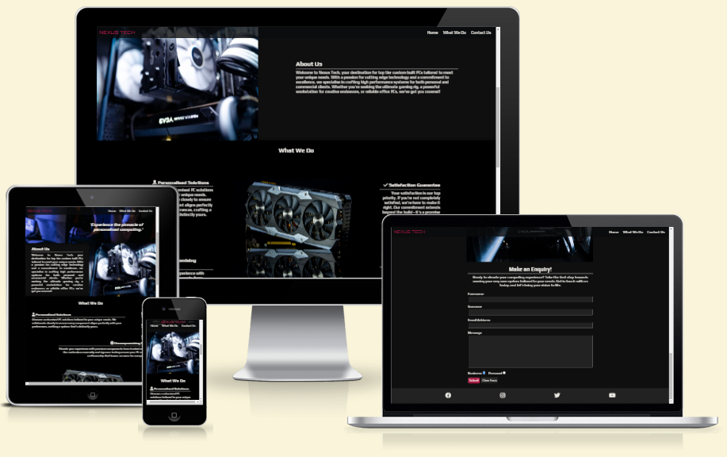
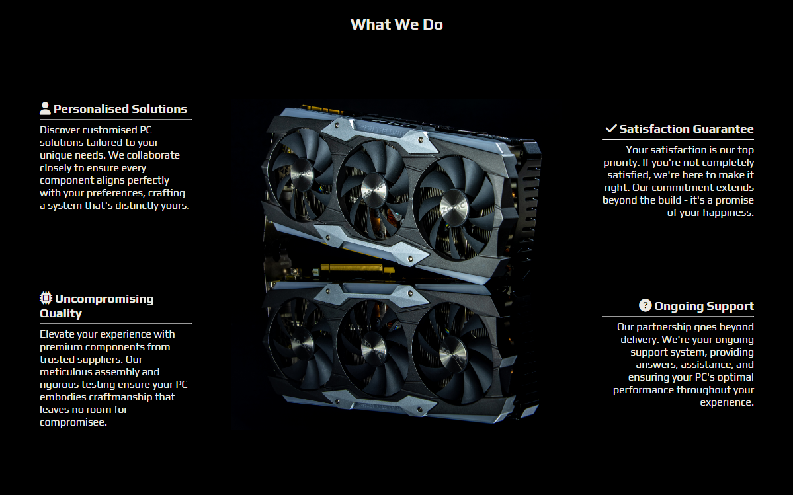
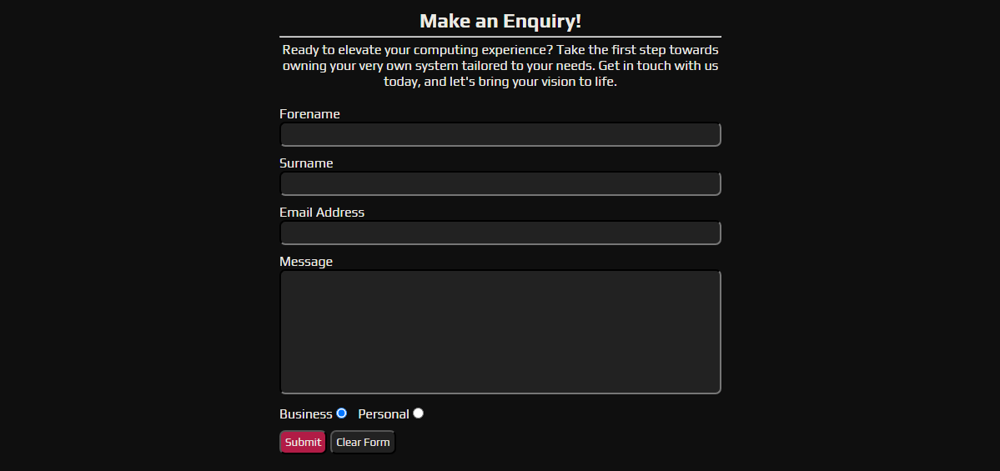

# NEXUS TECH

Nexus Tech is a single page website for a business that builds custom computers for both commercial and non-commercial clients with system requirements specifically tailored to the customers needs.

## Features

- ### Navigation Menu
  
  - The navigation menu contains links to the Home page via both the 'Home' button and the logo itself, the 'What We Do' section and the 'Contact Us' section.
  - The menu will follow the user as they navigate up and down the webpage to provide quick and easy access to any section at the click of a button.

- ### Hero Image

  - The hero section of the page displays an image overlayed with the business slogan 'Experience the pinnacle of personalised computing.'
  - The section uses an image to depict an example of a customer enjoying use of their own personalised system, and below this is a short short description of the business.

- ## What We Do Section

  - The What We Do section goes into further detail about what the business does.
  - Surrounding a responsive image of a graphics card are the four key principles thea Nexus Tech have to offer.

- ## Contact Us Section

  - This section offers the user a form to fill our where they can leave their name and email address and send a message to Nexus Tech to get in touch about developing their own personalised system/systems.

- ## Footer

  - The footer of the page provides the user with links to follow Nexus Tech on Facebook, Instagram, Twitter and YouTube.
  - Each of the four links will open in a new tab to prevent the user from losing their page on the Nexus Tech website while they navigate to social media.

